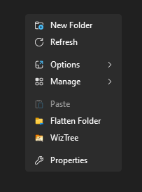

# folderFlattener
A windows context menu utility that "flattens" folders

I made this for myself a few months back.

Icon credit for flatten.ico: [Move To Folder](https://icons8.com/icon/hkFlMzuC0WxN/move-to-folder) icon by [Icons8](https://icons8.com)

Context menu made "sexy" with [IMA-Menu](https://github.com/iMAboud/iMA-Menu)
